<div align="center">

# 🚚 Logistics Management Platform

### Production-Inspired Full Stack Logistics & Goods Delivery System

A complete logistics ecosystem inspired by modern platforms like **Porter** and **Lalamove**, built to demonstrate scalable backend development, real-time communication, secure authentication, location-based services, and cross-platform mobile application development.

<p>


</p>

<p>


</p>

</div>

---

# 📑 Table of Contents

- Project Overview
- Why This Project?
- Applications
- Key Features
- Technology Stack
- System Architecture
- Backend Modules
- Skills Demonstrated
- Repository Structure
- Documentation
- Screenshots
- Getting Started
- Future Improvements
- Developer

---

# 📖 Project Overview

The **Logistics Management Platform** is a production-inspired full stack application designed to simulate how modern logistics companies manage customer bookings, driver operations, deliveries, payments, and administrative activities.

The project consists of four independent applications communicating through a centralized **Spring Boot Backend**.

- 📱 User Mobile Application
- 🚚 Driver Mobile Application
- 🖥️ Admin Dashboard
- ⚙️ Spring Boot Backend

The primary objective of this project was to gain hands-on experience in building scalable backend systems while integrating real-world technologies such as authentication, WebSockets, Redis caching, Google Maps, push notifications, and payment gateways.

---

# 🎯 Why This Project?

Instead of building a simple CRUD application, this project focuses on solving real-world logistics challenges including:

- Secure user authentication
- Driver onboarding and KYC
- Live driver tracking
- Vehicle selection
- Dynamic fare calculation
- Driver matching
- Ride lifecycle management
- Real-time communication
- Payment integration
- Administrative monitoring

The implementation follows production-style development practices by separating responsibilities across multiple applications and backend modules.

---

# 🚀 Applications

| Application | Description |
|------------|-------------|
| 📱 User App | Book deliveries, select vehicles, track drivers, chat, payments, ride history |
| 🚚 Driver App | Accept deliveries, navigation, KYC verification, earnings dashboard, ride management |
| 🖥️ Admin Dashboard | User management, driver management, analytics, support tickets, KYC verification |
| ⚙️ Spring Boot Backend | REST APIs, Authentication, Driver Matching, Notifications, Payments, WebSockets |

---

# ⭐ Project Highlights

### Backend Engineering

- JWT Authentication
- Spring Security
- OTP Login
- Role-Based Authorization
- RESTful APIs
- Spring Data JPA
- Hibernate ORM
- Global Exception Handling
- Validation
- PostgreSQL Integration
- Redis Caching
- Docker Support
- WebSocket Communication

---

### Mobile Development

- Flutter
- Provider State Management
- REST API Integration
- Secure Storage
- Google Maps Integration
- Firebase Notifications
- Responsive UI
- Real-Time Updates

---

### Software Engineering

- Modular Monolith Architecture
- Clean Architecture Principles
- Client-Server Architecture
- Layered Backend Design
- Database Design
- Authentication Flow
- Payment Integration
- Location-Based Services
- Real-Time Communication
- Scalable API Design

---

# 🛠 Technology Stack

## Backend

| Technology | Purpose |
|------------|---------|
| Java 17 | Core Backend Development |
| Spring Boot | Backend Framework |
| Spring Security | Authentication & Authorization |
| Spring Data JPA | ORM |
| Hibernate | Persistence Layer |
| PostgreSQL | Relational Database |
| Redis | Caching & Driver Matching |
| WebSockets | Real-Time Communication |
| Firebase | Push Notifications |
| Docker | Containerization |

---

## Mobile

| Technology | Purpose |
|------------|---------|
| Flutter | Cross-Platform Mobile Development |
| Dart | Programming Language |
| Provider | State Management |
| Google Maps | Maps & Navigation |
| Firebase | Notifications |
| REST APIs | Backend Communication |
| Secure Storage | Token Storage |

---

## Development Tools

- IntelliJ IDEA
- Android Studio
- VS Code
- Maven
- Git
- GitHub
- Docker Desktop
- Postman

---
# 🏗️ System Architecture

The application follows a **Modular Monolith Architecture**, where each business domain is separated into independent modules while sharing a single Spring Boot application.

This approach keeps the codebase maintainable, scalable, and easier to evolve into microservices in the future.

<p align="center">
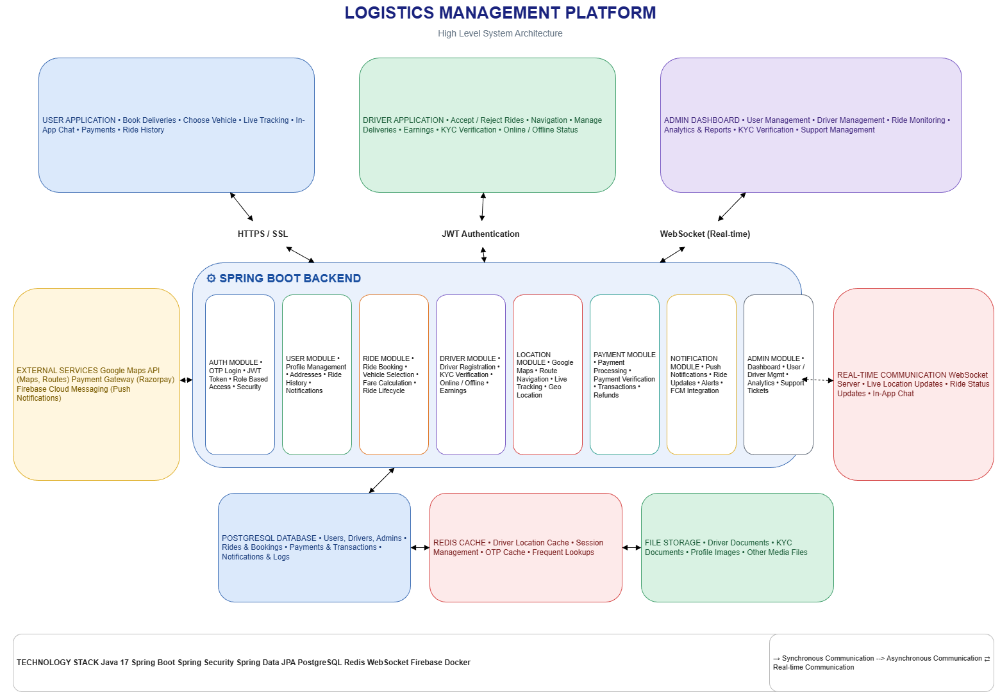
</p>

---

# ⚙️ High-Level System Workflow

```text
                   Customer Books Delivery
                              │
                              ▼
                     User Flutter App
                              │
                    REST API + JWT
                              │
                              ▼
                  Spring Boot Backend
                              │
        ┌─────────────┬──────────────┬──────────────┐
        │             │              │              │
 Authentication   Ride Service   Driver Service  Notification
        │             │              │              │
        └─────────────┴──────────────┴──────────────┘
                              │
          ┌───────────────────┼────────────────────┐
          │                   │                    │
     PostgreSQL            Redis           Firebase FCM
          │
      Google Maps API
          │
      Razorpay Payments
```

---

# 🏛 Backend Architecture

The backend is built using **Spring Boot** and follows a layered architecture that separates responsibilities into controllers, services, repositories, entities, DTOs, security, and configuration.

```
Controller
     │
     ▼
Service Layer
     │
     ▼
Repository Layer
     │
     ▼
PostgreSQL Database
```

This architecture improves:

- Code Maintainability
- Testability
- Separation of Concerns
- Scalability
- Reusability

---

# 🧩 Backend Modules

## 🔐 Authentication Module

Responsible for securing the platform.

### Features

- OTP Authentication
- JWT Token Generation
- Spring Security
- Role-Based Authorization
- Secure Password Encryption
- Token Validation
- Login & Logout
- Protected REST APIs

---

## 👤 User Module

Responsible for customer operations.

### Features

- User Registration
- Profile Management
- Saved Addresses
- Booking History
- Notifications
- Ride Tracking

---

## 🚚 Driver Module

Responsible for driver management.

### Features

- Driver Registration
- KYC Verification
- Online / Offline Status
- Ride Acceptance
- Navigation
- Earnings Dashboard
- Driver Ratings

---

## 📦 Ride Management Module

Responsible for the delivery lifecycle.

### Features

- Ride Booking
- Vehicle Selection
- Fare Calculation
- Driver Assignment
- Ride Status Updates
- Ride Completion
- Ride History

---

## 📍 Location Module

Responsible for map and location services.

### Features

- Google Maps Integration
- Current Location
- Pickup & Drop Selection
- Route Navigation
- Live Driver Tracking

---

## 🔔 Notification Module

Responsible for user communication.

### Features

- Push Notifications
- Booking Updates
- Driver Notifications
- Ride Completion Alerts
- Firebase Cloud Messaging

---

## 💳 Payment Module

Responsible for payment processing.

### Features

- Online Payments
- Payment Verification
- Ride Payment
- Transaction History

---

## 🛡 Admin Module

Responsible for platform administration.

### Features

- Dashboard Analytics
- Driver Management
- User Management
- Ride Monitoring
- Support Tickets
- KYC Verification
- Reports

---

# 💻 Engineering Highlights

This project demonstrates implementation of several real-world backend engineering concepts.

## Authentication

- JWT Authentication
- Spring Security
- OTP Login
- Role-Based Access Control
- Protected APIs

---

## API Development

- RESTful API Design
- Request Validation
- Exception Handling
- DTO Pattern
- Response Standardization

---

## Database Design

- PostgreSQL
- Entity Relationships
- JPA & Hibernate
- Normalized Schema
- Transaction Management

---

## Performance

- Redis Caching
- Efficient Database Access
- Optimized REST APIs

---

## Real-Time Communication

- WebSocket Integration
- Live Driver Tracking
- Instant Ride Updates
- Real-Time Notifications

---

## Security

- Password Encryption
- JWT Validation
- Role-Based Authorization
- Secure API Access

---

# 💡 Technical Skills Demonstrated

## Backend

- Java 17
- Spring Boot
- Spring Security
- Spring Data JPA
- Hibernate
- REST APIs
- JWT Authentication
- WebSockets
- PostgreSQL
- Redis
- Docker
- Firebase

---

## Mobile

- Flutter
- Provider
- REST API Integration
- Secure Storage
- Google Maps
- Firebase Notifications

---

## Software Engineering

- Modular Monolith
- Layered Architecture
- Clean Code
- SOLID Principles
- Authentication & Authorization
- Database Design
- API Design
- System Design
- Client-Server Architecture
- Real-Time Systems

---
# 📸 Application Showcase

The platform consists of **three Flutter applications** backed by a centralized **Spring Boot backend**. Each application is designed for a different user role within the logistics ecosystem.

---

# 📱 User Application

The User Application allows customers to book deliveries, choose vehicles, track drivers in real-time, communicate with drivers, and manage their delivery history.

### Core Features

- 📦 Book Deliveries
- 🚚 Vehicle Selection
- 📍 Live Driver Tracking
- 💬 In-App Chat
- 💳 Secure Payments
- 📜 Delivery History
- 🔔 Push Notifications
- 👤 User Profile Management

---

### Screenshots

| Login | Home |
|-------|------|
| 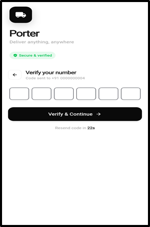 | 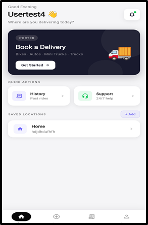 |

| Vehicle Selection | Tracking |
|------------------|----------|
| 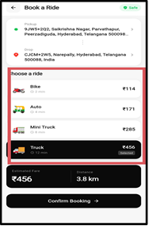 | 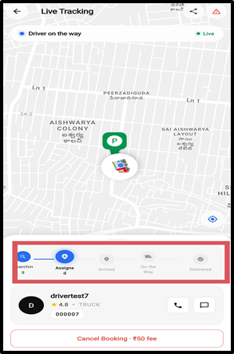 |

---

📖 **Detailed Documentation**

➡️ **[User Application Documentation](documentation/USER_APP_FEATURES.md)**

---

# 🚚 Driver Application

The Driver Application enables drivers to receive delivery requests, navigate efficiently, manage active deliveries, and monitor their earnings.

### Core Features

- 🚚 Accept / Reject Deliveries
- 📍 Google Maps Navigation
- 📦 Delivery Management
- 🟢 Online / Offline Availability
- 💰 Earnings Dashboard
- 📜 Delivery History
- 👤 Driver Profile
- 🪪 KYC Verification

---

### Screenshots

| Home | Ride Request |
|------|--------------|
| 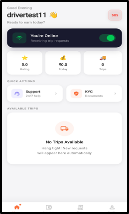 | 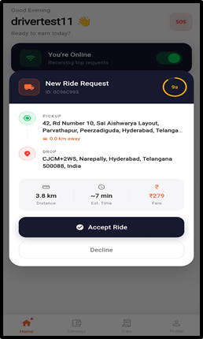 |

| Navigation | Earnings |
|------------|----------|
| 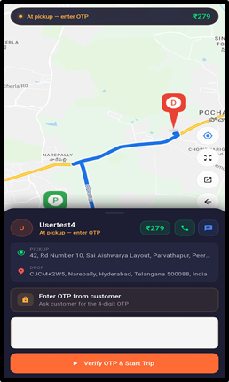 | 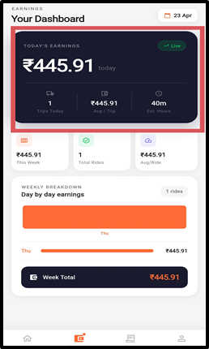 |

---

📖 **Detailed Documentation**

➡️ **[Driver Application Documentation](documentation/DRIVER_APP_FEATURES.md)**

---

# 🖥️ Admin Dashboard

The Admin Dashboard provides centralized control over users, drivers, deliveries, analytics, KYC verification, and platform monitoring.

### Core Features

- 👥 User Management
- 🚚 Driver Management
- 📈 Dashboard Analytics
- 🪪 Driver Verification
- 📦 Delivery Monitoring
- 🔔 Notification Management
- 📊 Reports & Insights
- 🛠️ Platform Administration

---

### Screenshots

| Dashboard | Analytics |
|-----------|-----------|
| 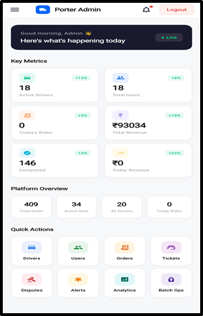 | 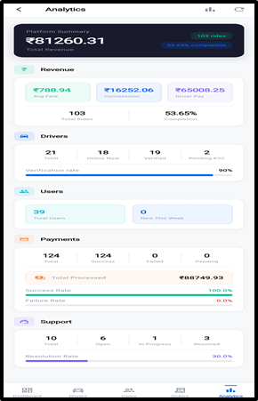 |

| Driver Management | Support ticket |
|-------------------|------------------|
| 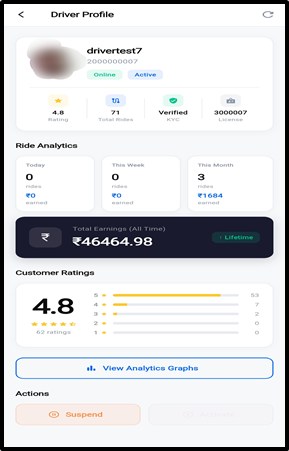 | 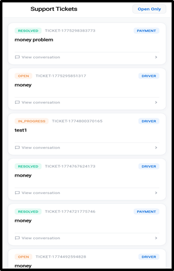 |

---

📖 **Detailed Documentation**

➡️ **[Admin Dashboard Documentation](documentation/ADMIN_APP_FEATURES.md)**

---

# 📊 Feature Comparison

| Feature | User | Driver | Admin |
|----------|:----:|:------:|:-----:|
| Authentication | ✅ | ✅ | ✅ |
| Profile Management | ✅ | ✅ | ✅ |
| Google Maps | ✅ | ✅ | ❌ |
| Live Location | ✅ | ✅ | ❌ |
| Push Notifications | ✅ | ✅ | ✅ |
| Ride Management | ✅ | ✅ | ✅ |
| Payment Integration | ✅ |✅ | ✅ |
| Chat | ✅ | ✅ | ✅ |
| Analytics | ✅ | ✅ | ✅ |
| Driver Verification | ❌ | ❌ | ✅ |
| Earnings Dashboard | ❌ | ✅ | ❌ |

---

# 📂 Repository Structure

```text
.
├── database/
│
├── documentation/
│   ├── USER_APP_FEATURES.md
│   ├── DRIVER_APP_FEATURES.md
│   └── ADMIN_APP_FEATURES.md
│
├── porter-admin-app/
├── porter-backend/
├── porter-driver-app/
├── porter-user-app/
│
├── screenshots/
│   ├── user/
│   ├── driver/
│   ├── admin/
│   └── architecture/
│
└── README.md
```

---

# 📚 Project Documentation

Comprehensive documentation is available for each application.

| Document | Description |
|----------|-------------|
| 📱 USER_APP_FEATURES.md | Complete User Application workflow, screens, and functionality |
| 🚚 DRIVER_APP_FEATURES.md | Driver onboarding, deliveries, navigation, and earnings |
| 🖥️ ADMIN_APP_FEATURES.md | Dashboard features, management tools, analytics, and administration |

These documents provide detailed information about the application's user interface, workflows, and implemented features.

---

# ⭐ Why This Project Stands Out

Unlike a typical CRUD application, this project demonstrates how multiple mobile applications communicate with a centralized backend to simulate a real-world logistics platform.

### Engineering concepts showcased

- Multi-Application Architecture
- Secure Authentication & Authorization
- Role-Based Access Control
- RESTful API Design
- Real-Time Communication
- Location-Based Services
- Payment Workflow
- Database Design
- State Management
- Modular Backend Architecture
- Production-Oriented Project Structure
- Mobile & Backend Integration

---
# 🚀 Getting Started

## Prerequisites

Before running the project, ensure the following software is installed on your system.

| Software | Version |
|----------|---------|
| Java | 17 or above |
| Maven | Latest |
| Flutter SDK | Latest Stable |
| Android Studio | Latest |
| PostgreSQL | 14+ |
| Redis | Latest |
| Docker Desktop | Optional |
| Git | Latest |

---

# 📦 Clone Repository

```bash
git clone https://github.com/YOUR_GITHUB_USERNAME/YOUR_REPOSITORY_NAME.git

cd YOUR_REPOSITORY_NAME
```

---

# ⚙️ Backend Setup

Navigate to the backend project.

```bash
cd porter-backend
```

Install dependencies.

```bash
mvn clean install
```

Configure your database inside

```
application.properties
```

Example

```properties
spring.datasource.url=jdbc:postgresql://localhost:5432/porter_db
spring.datasource.username=postgres
spring.datasource.password=your_password
```

Start PostgreSQL and Redis.

Run the application.

```bash
mvn spring-boot:run
```

Backend will be available at

```
http://localhost:8080
```

---

# 📱 Flutter Applications

Each Flutter application can be started independently.

## User Application

```bash
cd porter-user-app

flutter pub get

flutter run
```

---

## Driver Application

```bash
cd porter-driver-app

flutter pub get

flutter run
```

---

## Admin Application

```bash
cd porter-admin-app

flutter pub get

flutter run
```

---

# 🗄️ Database

The repository includes a dedicated **database** directory containing the required database resources.

This may include:

- Database Schema
- SQL Scripts
- Sample Data
- Database Documentation

---

# 🐳 Docker Support

If Docker is configured for your environment, you can build and run the backend using:

```bash
docker compose up --build
```

---

# 📈 Project Statistics

### Applications

- 📱 User Flutter Application
- 🚚 Driver Flutter Application
- 🖥️ Admin Flutter Application
- ⚙️ Spring Boot Backend

---

### Backend Technologies

- Java
- Spring Boot
- Spring Security
- Spring Data JPA
- Hibernate
- PostgreSQL
- Redis
- WebSockets
- Firebase Cloud Messaging
- Docker

---

### Mobile Technologies

- Flutter
- Dart
- Provider
- Google Maps
- Firebase
- REST APIs

---

### Core Features

- Secure Authentication
- Role-Based Authorization
- Driver Matching
- Ride Booking
- Vehicle Selection
- Google Maps Integration
- Live Driver Tracking
- Push Notifications
- Payment Integration
- Ride History
- Dashboard Analytics
- KYC Verification

---

# 🛣️ Future Roadmap

Planned enhancements include:

- Wallet Integration
- Ride Scheduling
- AI-Based Driver Matching
- Dynamic Pricing
- Route Optimization
- Microservices Migration
- CI/CD Pipeline
- Unit Testing
- Integration Testing
- Performance Monitoring
- Kubernetes Deployment

---

# 📚 Learning Outcomes

This project provided practical experience in:

### Backend

- Building enterprise-level REST APIs
- Spring Security implementation
- JWT Authentication
- Database modeling using JPA
- Redis caching
- WebSocket communication
- Dockerized backend deployment

---

### Mobile

- Flutter application architecture
- State management using Provider
- REST API integration
- Google Maps implementation
- Push notifications
- Secure local storage

---

### Software Engineering

- Modular Monolith Architecture
- Layered Architecture
- Client–Server Communication
- Authentication & Authorization
- Database Design
- Clean Code Principles
- Production-Oriented Project Structure

---

# 🤝 Contributing

Contributions, suggestions, and improvements are always welcome.

1. Fork this repository

2. Create a new branch

```bash
git checkout -b feature/new-feature
```

3. Commit your changes

```bash
git commit -m "Added new feature"
```

4. Push your branch

```bash
git push origin feature/new-feature
```

5. Open a Pull Request

---

# 📄 License

This repository is published for **educational and portfolio purposes**.

---

# 👨‍💻 Developer

## Saipranay Thadakamalla

Computer Science Engineering Graduate

Java Full Stack Developer | Backend Engineer

### Connect with Me

GitHub

```
https://github.com/YOUR_USERNAME
```

LinkedIn

```
https://linkedin.com/in/YOUR_LINKEDIN_PROFILE
```

Email

```
YOUR_EMAIL@gmail.com
```

---

# 🙏 Acknowledgements

This project was built by exploring real-world logistics workflows and implementing them using modern backend and mobile development technologies.

Special thanks to the open-source community and the technologies that made this project possible:

- Spring Boot
- Flutter
- PostgreSQL
- Redis
- Firebase
- Google Maps Platform
- Docker
- Maven

---

<div align="center">

# ⭐ Thank You for Visiting!

If you found this repository interesting, consider giving it a **Star** ⭐

It motivates me to continue building and learning.

Happy Coding! 🚀

</div>