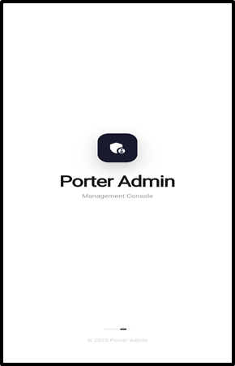
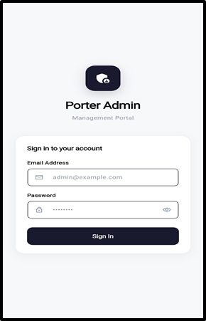
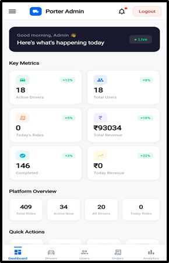
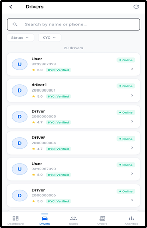
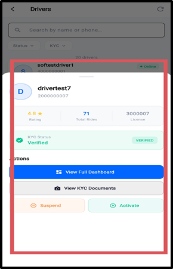
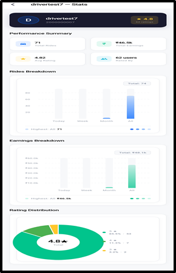
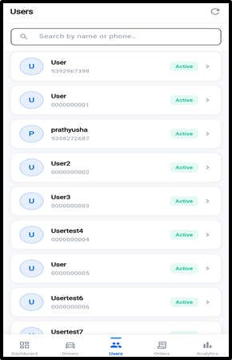
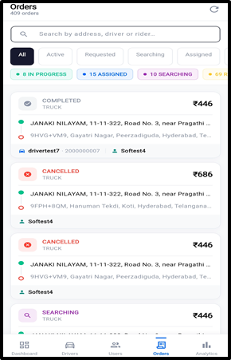
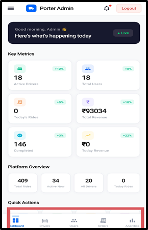

# DELIVERY-LOGISTIC — Admin Application

**Feature Documentation**

---

## Table of Contents

1. [Splash & Login](#1-splash--login)
2. [Dashboard — Overview & KPIs](#2-dashboard--overview--kpis)
3. [Driver Management](#3-driver-management)
4. [KYC Management & Verification](#4-kyc-management--verification)
5. [User Management](#5-user-management)
6. [Active Orders Management](#6-active-orders-management)
7. [Analytics & Reports](#7-analytics--reports)
8. [Support Ticket Management](#8-support-ticket-management)
9. [Dispute Resolution](#9-dispute-resolution)
10. [Emergency Alerts (SOS)](#10-emergency-alerts-sos)
11. [Payout & Payment Management](#11-payout--payment-management)
12. [Navigation & Layout](#12-navigation--layout)

---

## 1. Splash & Login

The admin app features a secure authentication screen tailored for administrative access. Only authorized admin accounts can log in.

### Key Highlights

- **Branded Splash Screen:** Porter Admin logo with professional loading animation
- **Admin Login:** Email/phone + password or OTP-based login for verified admin accounts
- **Role Validation:** Backend verifies the user has admin privileges before granting access
- **Session Persistence:** Admin stays logged in across app restarts via secure token storage
- **Secure Logout:** Available from app bar and drawer menu

### Screenshots

---

## 2. Dashboard — Overview & KPIs

The dashboard is the admin's command center — it shows all critical platform metrics at a glance, helping administrators monitor the health and activity of the entire Porter ecosystem.

### Key Highlights

- **Greeting Banner:** Time-based greeting with a dark-themed card and a green "● Live" status indicator
- **Key Metrics Grid (2x3):** Six primary KPI cards, each with colored icon, metric value, label, and growth percentage badge
  - Active Drivers — Number of drivers currently online
  - Total Users — Total registered customers
  - Today's Rides — Rides created today
  - Total Revenue — Lifetime platform revenue (₹)
  - Completed Rides — Total completed rides
  - Today's Revenue — Revenue earned today (₹)
- **Platform Overview Row:** Four compact stat pills — Total Rides | Active Now | All Drivers | Today Rides
- **Quick Actions Grid (4×2):** Eight quick-access buttons — Drivers, Users, Orders, Tickets, Disputes, Alerts, Analytics, Batch Ops

### Screenshots

---

## 3. Driver Management

The driver management screen provides a comprehensive view of all registered drivers on the platform. Admins can view driver profiles, manage statuses, and drill into individual driver dashboards.

### Key Highlights

- **Driver List:** Searchable, scrollable list of all registered drivers
- **Driver Cards:** Shows name, phone, vehicle type/number, KYC status, online/offline status, rating and total ride count
- **Search & Filter:** Search by name, phone, or vehicle number
- **Driver Dashboard (Detail View):** Full profile info, ride history, earnings, performance metrics, vehicle/document details, KYC status
- **Driver Stats Graphs:** Visual charts showing earnings over time, ride frequency, rating trends
- **Action Controls:** Verify/Reject KYC, Activate/Deactivate driver, view ride history and earnings
- **Pull-to-Refresh:** Reload driver list

### Screenshots

---

## 4. KYC Management & Verification

The KYC management screen allows admins to review, verify, or reject driver KYC submissions. This is a critical compliance feature ensuring only verified drivers can operate on the platform.

### Key Highlights

- **KYC Queue:** Filtered by Submitted (awaiting review), Verified (approved), Rejected, and Pending
- **Document Review:** Driver profile info, vehicle details, and uploaded documents — Aadhaar, Driving License, RC, Insurance
- **Verification Actions:** Approve (enables driver to go online) or Reject with reason (driver can re-submit)
- **Status Badges:** Color-coded indicators throughout
- **Search & Sort:** Find specific KYC submissions quickly
- **Bulk Actions:** Process multiple KYC submissions at once

---

## 5. User Management

Admins can view and manage all registered users (customers) on the platform.

### Key Highlights

- **User List:** Scrollable list of all registered customers with name, phone, registration date, total rides, and account status
- **Search Functionality:** Search users by name or phone number
- **User Dashboard:** Full profile, ride history, total spending, support ticket history
- **User Stats Graphs:** Visual charts — ride frequency and spending trends
- **Action Controls:** View ride history, access support tickets, activate/deactivate account

### Screenshots

---

## 6. Active Orders Management

Real-time view and management of all currently active rides on the platform.

### Key Highlights

- **Active Orders List:** All rides currently in progress
- **Order Cards:** Ride ID, user/driver info, pickup/drop addresses, status, fare, time elapsed
- **Status Color Coding:** Assigned (blue), Arrived (yellow), In Progress (green), Completed (tick), Cancelled (red)
- **Order Management:** View details, cancel ride, contact driver/user, view on map
- **Real-Time Updates & Pull-to-Refresh**

### Screenshots

---

## 7. Analytics & Reports

A comprehensive analytics dashboard providing data-driven insights into platform performance, revenue trends, and operational metrics.

### Key Highlights

- **Revenue Analytics:** Total revenue summaries (daily/weekly/monthly), growth trends, revenue per ride category
- **Ride Analytics:** Total rides, completed vs cancelled ratio, peak hours, average distance and duration
- **Driver Analytics:** Active driver trends, utilization rates, top performers, rating distribution
- **User Analytics:** User growth trends, active user metrics, retention rates, top customers
- **Visual Charts:** Interactive line/bar charts with period selectors (Daily, Weekly, Monthly)
- **Analytics Graph Screen:** Payment and support ticket with detailed graph views

### Screenshots

---

## 8. Support Ticket Management

Admins can view, manage, and respond to support tickets raised by both users and drivers.

### Key Highlights

- **Ticket List:** All support tickets with ID, subject, raised by, status, category, date, and priority
- **Ticket Detail View:** Full description, message thread, admin reply, status change, related ride info
- **Resolution Actions:** Reply, escalate, mark as resolved, close

### Screenshots

---

## 9. Dispute Resolution

A dedicated screen for managing ride disputes between users and drivers.

### Key Highlights

- **Dispute List:** ID, type, parties involved, related ride info, status, date raised
- **Dispute Detail View:** Full description from both parties, related ride details, evidence/screenshots, admin notes
- **Resolution Actions:** Review details, contact parties, make decision, issue refund or adjustment, mark resolved

---

## 10. Emergency Alerts (SOS)

Real-time emergency alert management for SOS signals sent by drivers in distress.

### Key Highlights

- **Alert List:** Driver name/phone, timestamp, GPS coordinates, status (Active, Acknowledged, Resolved)
- **Response Actions:** Acknowledge, contact driver, dispatch assistance, mark resolved
- **Priority Display:** Active alerts prominently highlighted in red
- **Real-Time Updates:** New SOS alerts appear automatically

---

## 11. Payout & Payment Management

Manage driver payouts, track payment transactions, and handle financial operations across the platform.

### Key Highlights

- **Payout Overview:** Summary of pending and completed payouts
- **Transaction Details:** Transaction ID, driver name, amount, payment method (Cash/Online), status, date
- **Payout Actions:** Process pending payouts, view history, generate reports, handle failed transactions
- **Financial Summaries:** Total payouts, pending amounts, revenue splits

---

## 12. Navigation & Layout

### Bottom Navigation Bar (5 tabs)

| Tab | Icon | Description |
|---|---|---|
| Dashboard | Dashboard icon | Main KPI overview |
| Drivers | Car icon | Driver management |
| Users | People icon | User management |
| Orders | Receipt icon | Active orders |
| Analytics | Chart icon | Analytics & reports |

### Side Drawer (Additional Sections)

| Section | Description |
|---|---|
| Support Tickets | Manage customer support |
| Disputes | Resolve ride disputes |
| Emergency Alerts | Active SOS & alerts |
| Payouts & Payments | Driver payouts & transactions |
| Logout | Sign out of admin console |

### App Bar

- **Porter Admin Logo:** Blue icon + title
- **Notification Bell:** With unread indicator dot
- **Logout Button:** Quick-access logout styled as red button

### Screenshots

---

## Summary of Key Features

| Feature | Description |
|---|---|
| Admin Dashboard | 6 KPI cards + overview row + quick actions grid |
| Driver Management | Full driver list with profiles, stats, and KYC |
| KYC Verification | Review, approve, or reject driver documents |
| User Management | Customer profiles, ride history, and spending |
| Active Orders | Real-time ride monitoring and management |
| Analytics & Reports | Revenue, ride, driver, and user analytics with charts |
| Support Tickets | Ticket list, detail view, reply, and status management |
| Dispute Resolution | Review and resolve user-driver disputes |
| Emergency Alerts | SOS monitoring with driver location |
| Payout Management | Driver payouts and payment transactions |
| Navigation Drawer | Access to all 10+ admin sections |
| Quick Actions | 8-button grid for instant section access |
| Real-Time Data | Live indicators and auto-refreshing dashboards |
