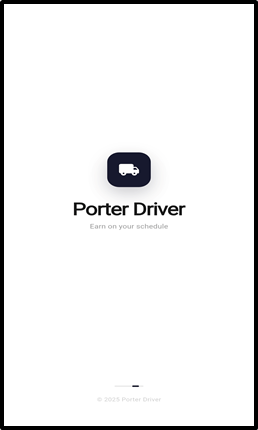
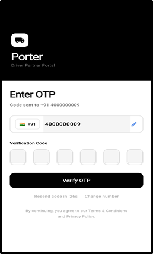
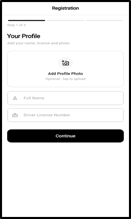
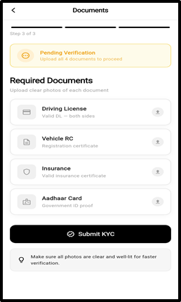
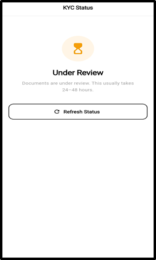
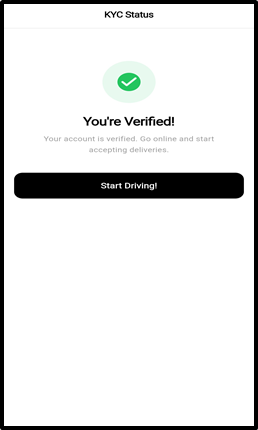
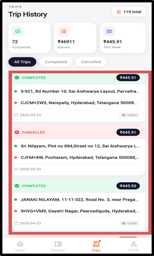
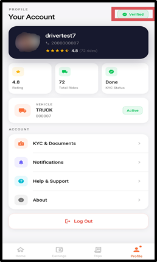
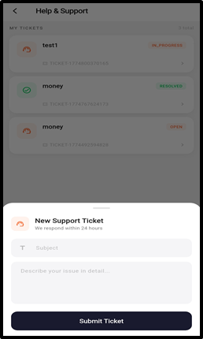

# DELIVERY-LOGISTICS — Driver Application

**Feature Documentation**

- **Platform:** Android / iOS (Flutter)
- **Version:** 1.0
- **Last Updated:** April 2026

---

## Table of Contents

1. [Splash & Onboarding](#1-splash--onboarding)
2. [Authentication — Login & OTP Verification](#2-authentication--login--otp-verification)
3. [KYC Onboarding — Driver Verification](#3-kyc-onboarding--driver-verification)
4. [Home Screen — Dashboard](#4-home-screen--dashboard)
5. [Ride Request Modal](#5-ride-request-modal)
6. [Active Delivery — Live Navigation](#6-active-delivery--live-navigation)
7. [Earnings Dashboard](#7-earnings-dashboard)
8. [Trip History](#8-trip-history)
9. [Driver Profile Management](#9-driver-profile-management)
10. [SOS Emergency Alert](#10-sos-emergency-alert)
11. [Support & Help Center](#11-support--help-center)

---

## 1. Splash & Onboarding

The driver app opens with a branded splash screen that checks the driver's authentication state and KYC verification status, automatically routing to the appropriate screen.

### Key Highlights

- Branded Porter Driver logo with loading animation
- Automatic session detection — returns logged-in drivers to the home screen
- KYC status check — redirects unverified drivers to the KYC onboarding flow

### Screenshots

---

## 2. Authentication — Login & OTP Verification

Drivers authenticate securely using their phone number and a One-Time Password (OTP) — the same passwordless flow used across the Porter ecosystem.

### Key Highlights

- **Phone Number Entry:** Clean input with +91 country code pre-filled
- **OTP Delivery:** One-tap sends a verification code via SMS
- **OTP Verification:** Secure 4-6 digit code entry with countdown timer for resend
- **Token Storage:** JWT tokens stored securely for session persistence
- **Role Detection:** Backend identifies user as driver and returns driver-specific token and profile

### User Flow

`Enter Phone Number → Tap 'Send OTP' → Receive OTP → Enter Code → Logged In → KYC Check`

### Screenshots

---

## 3. KYC Onboarding — Driver Verification

New drivers must complete a 3-step KYC verification process before they can go online and accept rides.

### Step 1 — Profile Setup

- **Profile Photo Upload:** Camera or gallery picker with crop/preview
- **Full Name Entry:** Required field for official name
- **Driver License Number:** Required field for DL verification

### Step 2 — Vehicle Registration

- **Vehicle Type Selection:** Bike, Auto, Mini Truck, Truck — each with emoji icon and description
- **Vehicle Number Entry:** Registration number (e.g., KA01AB1234)
- **Vehicle Model Entry:** Optional make and model

### Step 3 — Document Upload

- **Required Documents:** Driving License, Vehicle RC, Insurance Certificate, Aadhaar Card
- **Upload from Gallery:** Tap any document card to pick an image
- **Status Indicators:** Gray (not selected), Green checkmark (uploaded), Spinner (in progress)

### KYC Status Screen

- **Submitted:** "Your documents are under review" with Refresh button
- **Verified:** Green check "You're Verified!" with "Start Driving!" button
- **Rejected:** Red icon "KYC Rejected" with "Re-submit KYC" button

### Screenshots

---

## 4. Home Screen — Dashboard

The driver home screen serves as the command center — showing earnings, stats, and available trip requests at a glance.

### Key Highlights

- **Personalized Greeting:** Time-based greeting with driver's first name
- **Online/Offline Toggle:** Animated card changes color — dark when online, white when offline
- **Quick Stats Row:** Rating, Today's Earnings (₹), Trips completed today
- **Quick Action Cards:** Support (24/7 help) and KYC (documents management)
- **Available Trips Section:** Shows trip cards with route, distance, fare, and Accept button when online
- **Trip Card:** Green dot + pickup to drop route, distance chip, fare chip, Accept button
- **Pull-to-Refresh:** Swipe down to refresh stats and trip data

### Screenshots

---

## 5. Ride Request Modal

When a new ride request comes in, a visually striking modal appears with a countdown timer, giving the driver limited time to accept or decline.

### Key Highlights

- **Popup Modal:** Animated scale + fade entrance
- **Countdown Timer:** Circular progress ring showing remaining seconds (default 10s); turns red at ≤3s
- **Request Header:** "New Ride Request" title with ride ID and truck icon
- **Route Information:** Green pickup address and red drop address with dashed connector
- **Stats Bar:** Distance, estimated time, and fare
- **Action Buttons:** Accept Ride (primary) and Decline (outlined)
- **Auto-Navigation:** On acceptance, navigates to Active Delivery screen

### Screenshots

---

## 6. Active Delivery — Live Navigation

Once a ride is accepted, the driver enters the full-screen active delivery view with live GPS navigation and real-time communication tools.

### Delivery Phases

- **Phase 1 — Heading to Pickup:** 3D tilted map (17.5 zoom, 60° tilt), live blue route, ETA badge, "Arrive at Pickup" button
- **Phase 2 — At Pickup:** OTP verification (4-digit from customer), customer contact buttons
- **Phase 3 — In Transit:** Live GPS tracking, fare meter via WebSocket, "Complete Delivery" button
- **Phase 4 — Completed:** Earnings summary, customer rating, cash payment confirmation, "Finish & Go Home" button

### Technical Features

- **Dead Reckoning Engine:** Predicts driver position between GPS fixes for ultra-smooth movement
- **Smooth Marker Animation:** Tweened position interpolation — no jumping markers
- **Redis Location Broadcasting:** Driver location broadcast in real-time to user's tracking screen
- **Custom Map Markers:** Emoji-based vehicle markers on styled circular pins
- **Google Maps Integration:** One-tap "Open in Google Maps" for turn-by-turn navigation

### Screenshots

---

## 7. Earnings Dashboard

A comprehensive earnings overview with daily and weekly breakdowns, visual charts, and key financial metrics.

### Key Highlights

- **Hero Earnings Card:** Dark-themed, large earnings amount (₹), with Trips Today, Avg/Trip, Est. Hours
- **3-Stat Summary Row:** This Week (total weekly), Total Rides (count), Avg/Ride (average earnings)
- **Weekly Breakdown Card:** Mini bar chart with daily earnings, current day highlighted in accent color
- **Day-by-Day List:** Progress-bar rows showing earnings per day, proportional to daily maximum
- **Week Total Footer:** Dark bar showing total weekly earnings in accent color
- **Loading Skeleton:** Shimmer-style placeholder while data loads

### Screenshots

---

## 8. Trip History

Drivers can view their complete trip history with detailed information about each ride, filtered by status.

### Key Highlights

- **Summary Stats Row:** Completed trips, total earnings, weekly earnings
- **Filter Chips:** All Trips, Completed, Cancelled — active filter has dark background
- **Trip Cards:** Status header (color-coded), fare pill, route with pickup/drop, date, payment method badge
- **Empty States:** "No trips yet" or "No trips for this filter" with "Show all trips" link

### Screenshots

---

## 9. Driver Profile Management

The profile tab gives drivers complete visibility into their account information, vehicle details, KYC status, and account management options.

### Key Highlights

- **Profile Hero Card:** Dark-themed with avatar, full name, phone number, star rating, auto-refresh every 30s
- **Stats Row:** Rating, Total Rides, KYC Status
- **Vehicle Card:** Vehicle type, registration number, "Active" status badge
- **Account Menu:** KYC & Documents, Notifications, Help & Support, About
- **Logout Button:** Red-bordered card with confirmation dialog

### Screenshots

---

## 10. SOS Emergency Alert

Drivers have access to a one-tap emergency SOS button that sends their live location to the admin for immediate assistance.

### Key Highlights

- **SOS Button:** Prominently placed red button on home screen header
- **One-Tap Activation:** Instantly sends SOS alert with loading spinner
- **Live Location:** Captures current GPS coordinates using high-accuracy GPS
- **Admin Alert:** Sends to admin panel's Emergency Alerts screen
- **Feedback:** Confirmation snackbar "SOS Alert Sent!" once transmitted

---

## 11. Support & Help Center

Drivers can access 24/7 support through the in-app help center.

### Key Highlights

- **Create Support Ticket:** Submit issues with category, subject, and description
- **Ticket Management:** View all open and resolved issues
- **Status Tracking:** Open, In Progress, Resolved, Closed
- **Ticket Messaging:** Chat-style interface for communication with support team

### Screenshots

---

## Bottom Navigation Structure

| Tab | Icon | Description |
|---|---|---|
| Home | House icon | Dashboard, online toggle, trip requests |
| Earnings | Wallet icon | Daily/weekly earnings overview |
| Trips | Truck icon | Complete trip history |
| Performance | Chart icon | Ratings and metrics |
| Profile | Person icon | Account, vehicle, KYC, settings |

---

## Summary of Key Features

| Feature | Description |
|---|---|
| Phone + OTP Login | Secure, passwordless driver authentication |
| 3-Step KYC | Profile → Vehicle → Documents verification flow |
| Online/Offline Toggle | Control when to receive ride requests |
| Ride Request Modal | Timed popup with route, fare, and accept/decline |
| OTP Verification | Customer OTP required to start delivery |
| Live Navigation | 3D Google Maps with real-time GPS tracking |
| Dead Reckoning | Smooth position prediction between GPS fixes |
| Fare Meter | Real-time fare calculation via WebSocket |
| Earnings Dashboard | Daily/weekly charts and breakdowns |
| Trip History | Full ride log with status filtering |
| Performance Metrics | Rating, acceptance rate, cancellation rate |
| SOS Emergency | One-tap location alert to admin |
| Cash Confirmation | Confirm cash payment received |
| Customer Rating | Rate the customer after delivery |
| Support Tickets | In-app issue reporting and tracking |

---

© 2026 Porter. All rights reserved.
