# DELIVERY-LOGISTIC — User Application

**Feature Documentation**

---

## Table of Contents

1. [Splash & Onboarding](#1-splash--onboarding)
2. [Authentication — Login & OTP Verification](#2-authentication--login--otp-verification)
3. [Home Screen](#3-home-screen)
4. [Booking Flow — Location Selection & Vehicle Choice](#4-booking-flow--location-selection--vehicle-choice)
5. [Fare Estimation & Booking Confirmation](#5-fare-estimation--booking-confirmation)
6. [Real-Time Order Tracking](#6-real-time-order-tracking)
7. [In-App Chat with Driver](#7-in-app-chat-with-driver)
8. [Bill Confirmation & Payment](#8-bill-confirmation--payment)
9. [Ride History](#9-ride-history)
10. [User Account & Profile Management](#10-user-account--profile-management)
11. [Support & Help Center](#11-support--help-center)

---

## 1. Splash & Onboarding

The app opens with a branded splash screen featuring the Porter logo and a smooth loading animation, while checking the user's authentication status.

### Key Highlights

- Branded Porter logo with animation
- Automatic authentication state detection — redirects logged-in users directly to home
- Smooth transition to the appropriate screen

### Screenshots

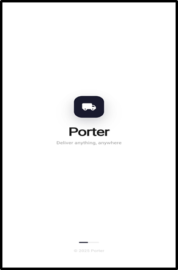

---

## 2. Authentication — Login & OTP Verification

Porter uses a secure, phone-number-based authentication system. Users enter their mobile number and receive a One-Time Password (OTP) — no passwords required.

### Key Highlights

- **Phone Number Entry:** Clean input field with country code pre-filled (+91 India)
- **OTP Sending:** One-tap "Send OTP" triggers a verification code
- **OTP Verification:** 4-6 digit OTP entry with auto-submit and countdown timer for resend
- **Session Persistence:** User stays authenticated across app restarts via secure token storage
- **Error Handling:** User-friendly messages for invalid numbers, expired OTPs, or network failures

### User Flow

`Enter Phone Number → Tap 'Send OTP' → Receive OTP via SMS → Enter OTP → Verified & Logged In`

### Screenshots

---

## 3. Home Screen

The home screen is the central hub — providing quick access to start a new booking, view active rides, and access saved addresses.

### Key Highlights

- **Greeting Banner:** Personalized greeting based on time of day with user's name
- **Active Ride Banner:** If a ride is in progress, a prominent "Track" button appears
- **Quick Booking Card:** Large "Where to?" card to immediately start a new booking
- **Saved Addresses:** Home, Office, etc. for one-tap re-booking
- **Vehicle Type Selector:** Horizontal scrollable cards — Bike, Auto, Mini Truck, Truck
- **Pull-to-Refresh:** Swipe down to refresh ride status and home data

### Screenshots

---

## 4. Booking Flow — Location Selection & Vehicle Choice

The booking flow guides users through selecting pickup and drop locations, choosing a vehicle type, and reviewing the fare estimate.

### Key Highlights

- **Pickup Location:** Auto-detects current location via GPS, with option to manually search
- **Drop Location:** Google Places-powered search with autocomplete suggestions
- **Interactive Map:** Full-screen Google Map with pickup/drop markers and route polyline
- **Vehicle Type Selection:** Bike, Auto, Mini Truck, Truck — each shows estimated fare and capacity
- **Dynamic Fare Calculation:** Uses Haversine formula for accurate distance-based estimates
- **Route Visualization:** Polyline rendered on map between pickup and drop-off

### User Flow

`Tap 'Where to?' → Enter/Select Pickup → Enter Drop Location → See Route on Map → Choose Vehicle Type → Review Fare → Confirm Booking`

### Screenshots

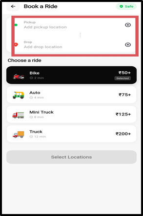

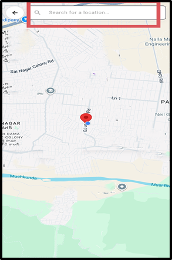

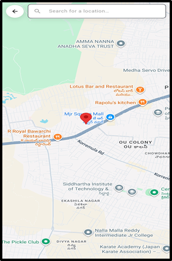

---

## 5. Fare Estimation & Booking Confirmation

Before confirming a ride, users see a clear breakdown of the estimated fare, calculated dynamically based on distance.

### Key Highlights

- **Distance-Based Fare:** Accurate calculation using Haversine formula
- **Fare Components:** Base fare + per-km charge displayed transparently
- **Vehicle-Specific Pricing:** Different rates per vehicle type (Bike cheapest, Truck most)
- **One-Tap Confirmation:** "Confirm Booking" button to place the ride request
- **Success Feedback:** Confirmation message and automatic redirect to tracking

### Screenshots

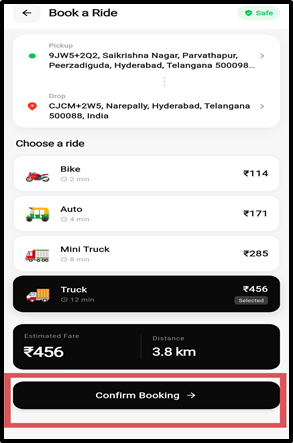

---

## 6. Real-Time Order Tracking

Once a ride is confirmed and a driver is assigned, users can track the entire delivery lifecycle in real-time on a live map.

### Key Highlights

- **Live Map Tracking:** Google Maps with real-time driver location updates via WebSocket
- **Smooth Marker Animation:** Driver's marker animates smoothly between position updates
- **Dead Reckoning Engine:** Predicts driver position between GPS updates for ultra-smooth tracking
- **Status Progress Bar:** Driver Assigned → Driver En Route → Driver Arrived → In Transit → Delivered
- **Driver Info Card:** Bottom sheet with driver name, photo, vehicle details, and rating
- **Contact Options:** One-tap phone call and in-app chat
- **ETA Display:** Estimated time of arrival with real-time updates
- **Cancel Ride:** Option to cancel with confirmation dialog (before pickup)

### Screenshots

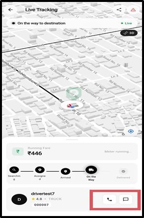

---

## 7. In-App Chat with Driver

Users can communicate with their assigned driver through a built-in real-time chat interface — no need to share personal phone numbers.

### Key Highlights

- **Real-Time Messaging:** Instant message delivery via WebSocket
- **Chat Bubbles:** Clean, modern UI with differentiated sender/receiver bubbles
- **Timestamps:** Each message shows the time it was sent
- **Auto-Scroll:** Chat automatically scrolls to the latest message
- **Driver Context:** Driver's name and vehicle details shown in the chat header
- **Persistent History:** Messages preserved for the duration of the ride

### Screenshots

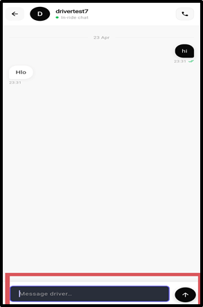

---

## 8. Bill Confirmation & Payment

After the ride is completed, users see a detailed bill breakdown and confirm payment.

### Key Highlights

- **Fare Breakdown:** Base fare, distance charge (per km × distance), time charge, total
- **Route Summary:** Pickup and drop addresses with visual route indicator
- **Distance & Duration:** Total distance traveled and time elapsed
- **Payment Method:** Cash payment support with confirmation
- **Driver Rating:** 1-5 star rating system
- **Success Animation:** Confirmation checkmark animation after payment

### Screenshots

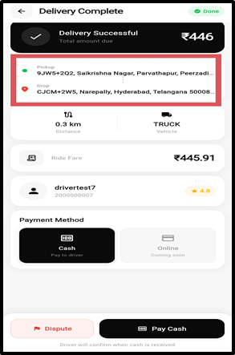

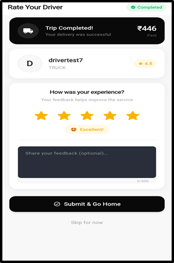

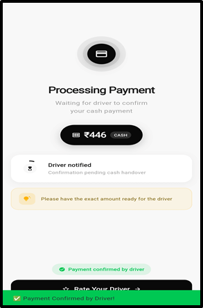

---

## 9. Ride History

Users can view a complete history of all their past rides.

### Key Highlights

- **Ride List:** Chronologically ordered with status badge, addresses, fare, date/time, payment method, vehicle type
- **Status Filtering:** All, Completed, Cancelled
- **Color-Coded Status:** Green for completed, red for cancelled, amber for in-progress
- **Pull-to-Refresh & Empty State**

### Screenshots

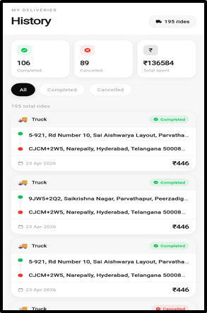

---

## 10. User Account & Profile Management

Users can manage their personal information, saved addresses, and app settings from the account screen.

### Key Highlights

- **Profile Hero Card:** Dark-themed with user's name, avatar (initials), phone, account creation date
- **Saved Addresses:** Manage home, office, and other saved locations
- **Edit Profile:** Update name and personal details
- **Account Menu:** Ride History, Notifications, Help & Support, About
- **Logout:** Secure logout with confirmation dialog

---

## 11. Support & Help Center

Users can create support tickets, browse FAQs, and get help directly within the app.

### Key Highlights

- **Create Support Ticket:** Submit issue with subject and description
- **Ticket Categories:** Ride issue, Payment, Driver complaint, etc.
- **Ticket Status:** Open (yellow), In Progress (blue), Resolved (green), Closed (red)
- **Ticket Messaging:** Chat-style interface for back-and-forth with support team

---

## Summary of Key Features

| Feature | Description |
|---|---|
| Phone + OTP Login | Secure, passwordless authentication |
| GPS Location | Auto-detect current location for pickup |
| Google Places Search | Autocomplete address search |
| 4 Vehicle Types | Bike, Auto, Mini Truck, Truck |
| Dynamic Fare Calculation | Haversine distance-based pricing |
| Real-Time Tracking | Live map with WebSocket updates |
| Smooth Map Animation | Dead reckoning + marker interpolation |
| In-App Chat | Real-time WebSocket messaging with driver |
| Ride History | Complete ride log with status filtering |
| Support Tickets | In-app issue reporting and tracking |
| Driver Rating | 1-5 star rating after each ride |
| Bill Breakdown | Transparent fare itemization |
| Pull-to-Refresh | Refresh data on all major screens |
| Active Ride Guard | Prevents duplicate tracking screens |
| Saved Addresses | Quick rebooking from saved locations |

---

